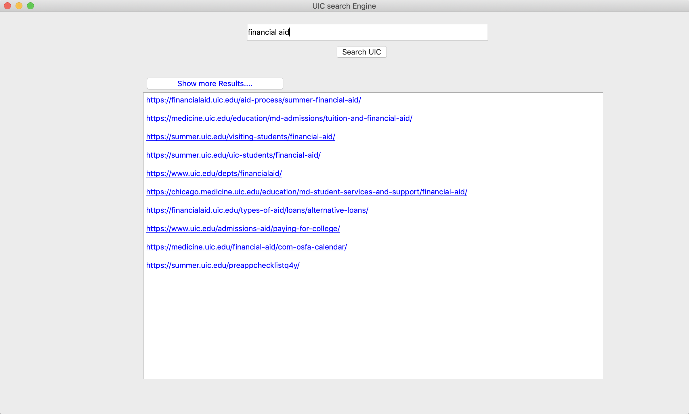

# Search Engine
### A Search Engine On UIC Domain

Final project for CS 582 Information Retrieval course at University of Illinois at Chicago

-

-

## Running the program

To run the program from terminal just use the command:

	python SearchEngine.py 

## Dependencies Required
- Pandas
- Pickle
- BeautifulSoup
- Requests
- nltk
- sklearn
- PyQt5

All the above dependencies can be installed through `pip install`

# Overview
-

A search engine implementation on the UIC domain (uic.edu) as part of the final project for the course CS 582 – Information Retrieval- at University of Illinois, Chicago
The search engine crawls the UIC domain, indexes the documents and these documents are parsed, preprocessed and vectorized. A UIC domain graph is generated based on these documents, on which page rank is applied.
The search engine has a simple UI which takes in the user query and returns the most relevant pages to the query in the UIC domain. The relevancy is calculated based on the cosine similarity and the page rank of the individual documents.

# Description
-
The search engine has the following components:

### Web Spider 
-
 Crawls the UIC domain, indexes and generates graph of the crawled pages.
 
### Processor 
-
Which loads individual documents, preprocess and vectorizes the documents.

### Ranker 
-

 Runs page rank on the UIC graph, ranks the documents based on the cosine similarity and the page ranks. 
 
### Access Interface 
-

Presents a graphical user interface of the search engine to the user, which accepts queries and retrieves the most relevant pages to the query.

During a normal run of the engine only Ranker and Access Interface are active. The processed pages and documents are stored in the binary format, which are accessed by the ranker and the Access Interface invokes the ranker with the query user provides.

